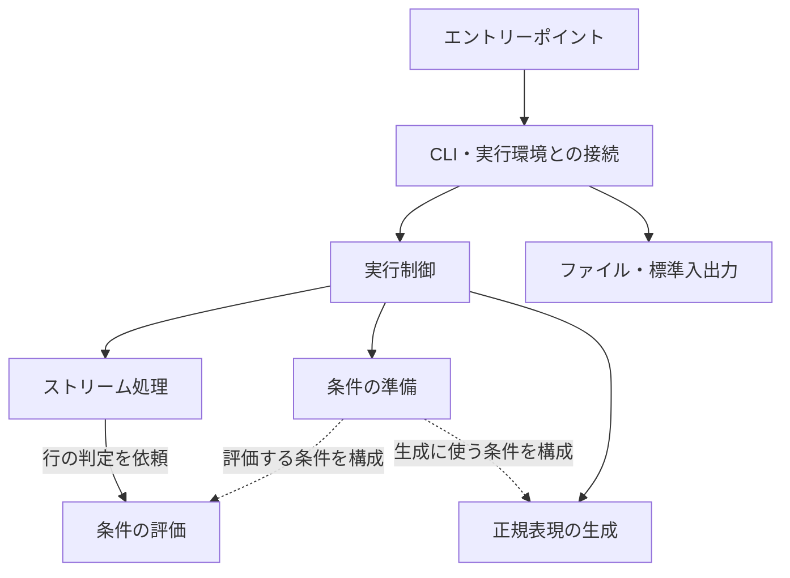

# sift のアーキテクチャ

## 目的と処理モデル

sift は、指定された条件を満たす行を入力から選び、出力へ書き出す CLI ツールです。
単一プロセス内で行単位に処理し、入力全体をメモリに保持せずに動作します。
複数の条件は AND で組み合わせ、選ばれた行の順序を維持します。

設計の中心は、実行環境との接続、実行制御、条件の準備、条件の評価、ストリーム処理の責務分担です。
ファイルや標準入出力の選択を変えても、条件の解釈と判定を共通で利用できます。
また、条件の評価は、一行の文字列だけを対象にして入出力から独立して扱えます。

## 責務の構造

| 責務 | 役割 |
| --- | --- |
| エントリーポイント | プロセスを起動し、実行結果をエラー表示と終了コードに変換する。 |
| CLI・実行環境との接続 | 引数を解釈し、入出力先を選択して、ファイルの寿命を管理する。 |
| 実行制御 | 条件の準備と入出力を組み合わせ、準備から実行・終了までを進める。 |
| 条件の準備 | 条件を解釈・検証し、評価する条件と評価順を決める。 |
| 条件の評価 | 準備された条件に基づき、一行がすべての条件を満たすか判定する。 |
| 正規表現の生成 | 準備された条件を外部で使用できる PCRE2 正規表現として表現する。 |
| ストリーム処理 | 入力から行を読み、条件の評価を呼び出し、一致した行を出力する。 |

以下の図は、責務間の呼び出しと、準備された条件を渡す関係を示します。

条件の準備とストリーム処理は、実行制御が組み合わせます。
条件の準備が評価できるフィルタを作り、ストリーム処理がそのフィルタに各行の判定を依頼します。
条件の評価は、引数の表記、ファイルパス、行の読み書きを知る必要がありません。

条件の準備は、解釈、検証、評価の構成という段階を持ちます。
解釈では指定された条件を読み取り、検証では値や組み合わせの妥当性を確認し、評価の構成では判定に使う条件と評価順を決めます。
これらは行の処理を始める前に一度行い、条件の評価は各行に対して繰り返します。

通常のチェックと正規表現の生成は、同じ条件の解釈・検証を共有します。
準備された条件は評価用の判定と正規表現の表現を持ち、実行制御がコマンドに応じて利用先を選びます。
生成では複数条件の AND を先読みで表現します。生成先の形式で表現できない条件は、通常のチェックを制限せずに生成エラーとして扱います。

## パッケージへの配置と依存関係

現在のパッケージ構成では、複数の責務を同じパッケージに配置しています。

| 配置 | 担う責務 |
| --- | --- |
| `main` | エントリーポイント。 |
| `internal/cli` | CLI・実行環境との接続、実行制御。 |
| `internal/filter` | 条件の準備、条件の評価、正規表現の生成、ストリーム処理。 |

パッケージの依存方向は `main` → `internal/cli` → `internal/filter` です。
この依存関係だけでは、同じパッケージ内にある責務の構造までは表しません。
責務の境界はパッケージを分割する前から保ち、各責務を独立したパッケージにするかは変更の必要性に応じて判断します。

ストリーム処理は、ファイルパスではなく読み取り・書き込み用のストリームを受け取ります。
同じ処理をファイル、標準入出力、メモリ上のデータに適用できます。
ストリームの選択と寿命の管理は実行環境との接続側が担います。

## データの流れ

実行は、準備と行の処理の二段階に分かれます。

1. CLI が、引数から入出力先と条件を取り出す。
2. 実行制御が条件の準備を呼び出し、検証済みのフィルタを受け取る。
3. 入出力を用意し、実行制御がストリーム処理にフィルタとストリームを渡す。
4. ストリーム処理が入力を順に読み、条件の評価に各行の判定を依頼する。
5. 判定結果に応じて一致した行を書き出し、最後に出力の書き込みを完了する。
6. 開いたファイルを閉じ、実行結果をエントリーポイントへ返す。

条件は行の処理を始める前に検証します。
不正な条件が指定された場合は、出力ファイルを作成・上書きする前に終了します。
条件の評価順は条件の準備で決めますが、すべての条件を満たすという判定結果は変わりません。

`regex` コマンドでは、条件の準備の後に正規表現を生成し、その文字列を出力します。
入力やストリーム処理を用意せず、条件の検証と生成を完了してから出力先を開きます。

## 入出力とエラーの境界

入力の既定値は標準入力、出力の既定値はカレントディレクトリの `sift.txt` です。
正規表現の生成では標準出力を既定とし、入力を使用しません。
入出力先を選ぶ方針と、入力・出力が同一ファイルかどうかの確認は、CLI・実行環境との接続側が担います。
そこで開いたファイルは同じ責務の中で閉じ、呼び出し側から渡された標準入出力は閉じません。

各層は失敗をエラーとして呼び出し側へ返します。
条件の準備、ストリーム処理、CLI・実行環境との接続が、それぞれの失敗に文脈を付けます。
原因を保持したまま伝播させ、最終的なエラー表示とプロセス終了はエントリーポイントに集約します。
エントリーポイントは CLI に表示を依頼し、CLI はエラーに続けて選択されたコマンドのヘルプを表示します。
明示的なヘルプ表示と失敗時のヘルプ表示は、同じオプション定義と条件の説明を使います。

出力は処理中に直接書き込むため、実行途中で失敗すると部分的な結果が残る場合があります。
実行全体を一括で確定・取り消しする仕組みは持ちません。

## 設計上の変更の境界

| 変更の対象 | 主に変更する責務 |
| --- | --- |
| 条件の表記や不正な指定の扱い | 条件の準備のうち、解釈・検証。 |
| 条件の判定規則 | 条件の評価と、それを構成する条件の準備。 |
| 条件の評価順 | 条件の準備のうち、評価の構成。 |
| 生成する正規表現の形式と制約 | 正規表現の生成と、条件の準備で構成する表現。 |
| 行の読み取り・出力方法 | ストリーム処理。 |
| 引数や入出力先、ファイルの寿命 | CLI・実行環境との接続。 |
| 準備と実行の組み合わせや順序 | 実行制御。 |
| 終了コードや最終的なエラー表示 | エントリーポイント。 |

条件の評価は入出力なしで、ストリーム処理はメモリ上の入出力で検証できます。
条件の準備と実行を分けることで、不正な指定の検証も行の処理から独立して扱えます。

コマンドの具体的な使い方と条件の仕様は [README.md](README.md) を参照してください。
